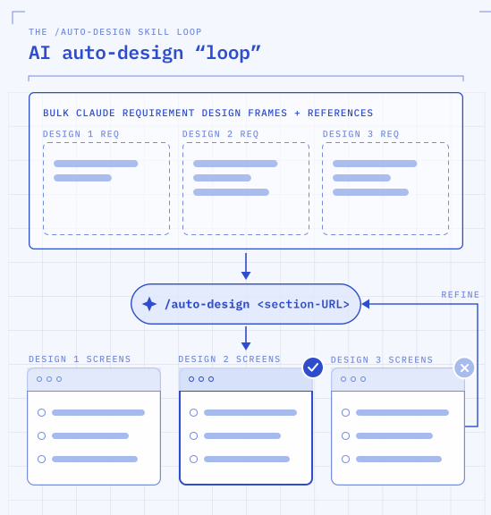

# auto-design



Generates Figma mockups from instructions written inside Figma frames, built from **your own design system**. Point it at a Figma Section whose sub-frames each describe a feature (a `Claude description:` spec + reference material), and it produces finished mockups for each — built from your design system's components and placed to the right of the reference.

## Installation

```bash
/plugin marketplace add drewmck/auto-design
/plugin install auto-design@auto-design
```

## Usage

```
/auto-design:auto-design <figma-section-url>
```

Pass the URL of a Figma **Section** (or Frame) that contains your feature frames.

On the **first run**, the skill asks which design system to use — its name and Figma library key — and remembers it in `~/.claude/auto-design/config.json`, so later runs never ask again. It then works through every feature in the section and reports back deep links to the screens it created.

> To switch design systems later, delete `~/.claude/auto-design/config.json` or say "reconfigure".

### How it works

1. **Design system setup (first run only)** — asks for your design system's name + Figma library key and stores it.
2. **Enumerates** the feature sub-frames in the section.
3. **Reads each spec** — the `Claude description:` text in the frame (color/styling doesn't matter; no red text required).
4. **Studies the reference material** in the frame so new work matches its visual language.
5. **Builds one converged design per feature** — a single design direction, refined, not multiple alternatives to choose between (a multi-screen *flow* is fine when the spec calls for it) — using your design system's components.
6. **Places new work to the right** of the reference material and captions each screen.
7. **Reports back** the new frame node IDs as clickable links, and flags any judgment calls.

## Setting up a feature frame

Create one Frame per feature inside your Section. In each frame, add:

- **A title** (short name of the feature), and a **spec** labeled `Claude description:` — e.g.

  > **Claude description:** Within the Chat screen, when a chat entry is hovered there should be a "rewind" icon to rewind the conversation to that point. Produce one screen for the hover state, and another after rewinding with a confirmation toast plus a new chat event.

  You can reference other nodes by URL in the spec; if a link goes stale the skill falls back to the reference frames inside the feature frame.
- **Reference material** — paste the existing app screen(s) and/or component examples the design should build on.

The skill places the finished screens to the **right** of this reference material, so leave room there.

## Requirements

- Your design system's **Figma library must be added to the target Figma file**.
- The Figma MCP server must be connected (the skill relies on `use_figma`, `get_metadata`, `get_screenshot`, `get_libraries`, and `search_design_system`).

## Available commands

| Command | Description |
|---|---|
| `/auto-design:auto-design <url>` | Produce mockups for every feature frame in the given Figma Section, using your configured design system. |

## Notes & conventions

- **Converge-only** — builds and refines one design direction per feature rather than exploring multiple alternatives.
- Works incrementally — builds a screen, screenshots to verify, fixes, then continues.
- Surfaces judgment calls (e.g. when a spec has no design-system equivalent) rather than guessing silently.
- See the skill body (`skills/auto-design/SKILL.md`) for the component-discovery guidance and the catalogue of Figma-plugin gotchas it guards against.

## License

[MIT](LICENSE)
